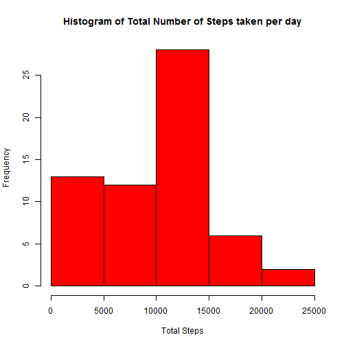
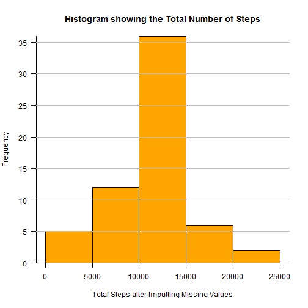

# Reproducible Research: Peer Assessment 1
=================================================

## Loading and preprocessing the data

```r
unzip("activity.zip")
rawActivityData <- read.csv("activity.csv")

totalSteps <- tapply(rawActivityData$steps, rawActivityData$date, sum, na.rm = TRUE)
dfSteps <- as.data.frame(totalSteps)
dfSteps <- cbind(names(totalSteps), dfSteps)
names(dfSteps) <- c("Date", "Steps")
```
## What is mean total number of steps taken per day?

### 1. Make a histogram of the total number of steps taken each day

```r
hist(dfSteps$Steps,main="Histogram of Total Number of Steps taken per day", xlab="Total Steps",
     col="red")
```

 
### 2. Calculate and report the mean and median total number of steps taken per day

```r
meanTotalNoOfStepsTakenPerDay <- mean(totalSteps, na.rm = T)
meanTotalNoOfStepsTakenPerDay
```

```
## [1] 9354
```

```r
medianTotalNoOfStepsTakenPerDay <- median(totalSteps, na.rm = T)
medianTotalNoOfStepsTakenPerDay
```

```
## [1] 10395
```
## What is the average daily activity pattern?

### 1. Make a time series plot (i.e. type = "l") of the 5-minute interval (x-axis) and the average number of steps taken, averaged across all days (y-axis)

```r
#Summarize by getting the MEAN number of Steps per interval
require(plyr)
```

```
## Loading required package: plyr
```

```r
summaryStepsByIntervalMean <- ddply(rawActivityData, c("interval"), summarise, meanSteps = mean(steps, na.rm = T))

#Create a column that will translate the interval to an actual time of the day in HH:MM format
require("stringr")
```

```
## Loading required package: stringr
```

```r
summaryStepsByIntervalMean$TimeInterval <- str_pad(summaryStepsByIntervalMean$interval, width=4, pad="0")

require("lubridate")
```

```
## Loading required package: lubridate
## 
## Attaching package: 'lubridate'
## 
## The following object is masked from 'package:plyr':
## 
##     here
```

```r
summaryStepsByIntervalMean$TimeInterval <- parse_date_time(summaryStepsByIntervalMean$TimeInterval,"%H%M")

#The line below was used only for the aesthetic purpose of controlling the X-label 
year(summaryStepsByIntervalMean$TimeInterval) <- year(now())

#Create the line plot for the daily activity pattern
require("ggplot2")
```

```
## Loading required package: ggplot2
```

```r
require("scales")
```

```
## Loading required package: scales
```

```r
timeRange <- range(summaryStepsByIntervalMean$TimeInterval)

dapPlot <- ggplot(summaryStepsByIntervalMean,
                  aes(x = TimeInterval, y = meanSteps)) +
                  geom_line(colour = "orange") + geom_point(size = 1, shape = 21) + 
                  scale_x_datetime(breaks = date_breaks("2 hour"), 
                                  minor_breaks=date_breaks("30 min"), 
                                  labels = date_format("%H:00"), 
                                  limits = timeRange) +
                  xlab("Time Slot") + ylab("Steps (averaged)") +
                  ggtitle("Daily Activity Pattern")
print(dapPlot)
```

 

### 2. Which 5-minute interval, on average across all the days in the dataset, contains the maximum number of steps?

```r
maxSteps <- which.max(summaryStepsByIntervalMean$meanSteps)
interval <- summaryStepsByIntervalMean$interval[maxSteps]
timeInterval <- format(summaryStepsByIntervalMean$TimeInterval[maxSteps],"%H:%M")
```
The interval with the maximum number of steps is 835. The interval corresponds to the time 08:35.

The plot is optimized, as best as I can, to see the 08:35 interval.
## Imputing missing values
### 1. Calculate and report the total number of missing values in the dataset (i.e. the total number of rows with NAs)

```r
totalMissing <- sum(is.na(rawActivityData$steps))
```
Total number of missing values in the dataset is 2304.

#### For Questions 2 & 3 I'll be using a [strategy](http://www.mail-archive.com/r-help@r-project.org/msg58289.html) inspired by Master Hadley Wickham

### 2. Devise a strategy for filling in all of the missing values in the dataset. The strategy does not need to be sophisticated. For example, you could use the mean/median for that day, or the mean for that 5-minute interval, etc.

```r
require(plyr)
impute.mean <- function(x){
    replace(x, is.na(x), mean(x, na.rm=TRUE))
}
```


### 3. Create a new dataset that is equal to the original dataset but with the missing data filled in.

```r
#Create an equivalent Dataset
activityDataWithImputedMean <- ddply(rawActivityData[1:3], .(interval),
                                     transform, steps=impute.mean(steps),
                                     date=date, interval=interval)
#Sort by Date and Interval
activityDataWithImputedMean <- 
  activityDataWithImputedMean[order(activityDataWithImputedMean$date,
                              activityDataWithImputedMean$interval), ]
head(activityDataWithImputedMean)
```

```
##       steps       date interval
## 1   1.71698 2012-10-01        0
## 62  0.33962 2012-10-01        5
## 123 0.13208 2012-10-01       10
## 184 0.15094 2012-10-01       15
## 245 0.07547 2012-10-01       20
## 306 2.09434 2012-10-01       25
```

### 4. Make a histogram of the total number of steps taken each day and Calculate and report the mean and median total number of steps taken per day. Do these values differ from the estimates from the first part of the assignment? What is the impact of imputing missing data on the estimates of the total daily number of steps?

```r
# Calculate total steps taken per day
dfTotalStepsPerDay <- ddply(activityDataWithImputedMean, c("date"), 
                            summarise, summedSteps = sum(steps))

#Create the Histogram
par(yaxs="i",las=1) #The las=1 makes the y-axis labels horizontal for better readability
hist(dfTotalStepsPerDay$summedSteps,main="Histogram showing the Total Number of Steps", 
     xlab="Total Steps after Imputting Missing Values",col="orange")
box(bty="l")
grid(nx=NA,ny=NULL,lty=1,lwd=1,col="gray")
```

 

The mean has increased. If the original was 9354.2295, the mean after imputting the missing values is

```r
mean(dfTotalStepsPerDay$summedSteps)
```

```
## [1] 10766
```


The median has increased as well. The original was 10395. Median after imputting the missing values is

```r
median(dfTotalStepsPerDay$summedSteps)
```

```
## [1] 10766
```


## Are there differences in activity patterns between weekdays and weekends?
### 1. Create a new factor variable in the dataset with two levels - "weekday" and "weekend" indicating whether a given date is a weekday or weekend day.

```r
# create factor column separating weekdays from weekends
activityDataWithImputedMean$weekend <- 
    ifelse((weekdays(as.Date(activityDataWithImputedMean$date)) %in% 
              c('Saturday','Sunday')),
           'weekend', 'weekday') 
activityDataWithImputedMean$weekend <- 
    as.factor(activityDataWithImputedMean$weekend)
```

So if `activityDataWithImputedMean$weekend == TRUE`, the day corresponds to a weekend day.
    
### 2. Make a panel plot containing a time series plot (i.e. type = "l") of the 5-minute interval (x-axis) and the average number of steps taken, averaged across all weekday days or weekend days (y-axis). 

```r
# calculate mean for each interval on the weekend and weekdays
intervalWeekendMean <- aggregate(activityDataWithImputedMean$steps, 
                                 by=list(activityDataWithImputedMean$weekend,
                                         activityDataWithImputedMean$interval), 
                                         FUN = mean)
names(intervalWeekendMean) <- c("weekend", "interval", "steps")

# plot both patterns
require(lattice)
```

```
## Loading required package: lattice
```

```r
xyplot(steps~interval|weekend,data=intervalWeekendMean,type="l",layout = c(1,2))
```

 
